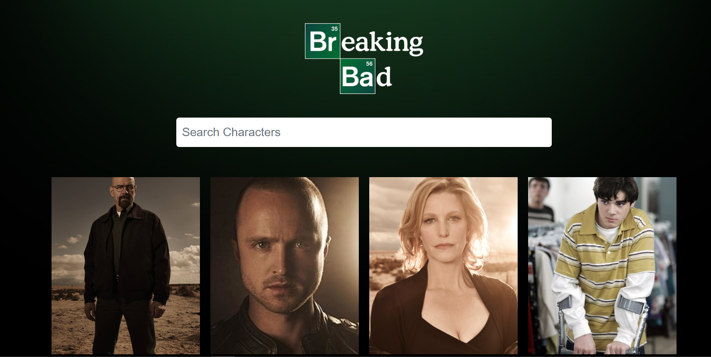
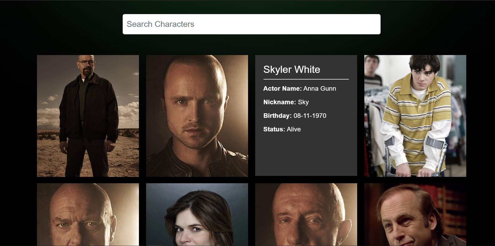

A website made Using The Breaking Bad API. 
Displays all the characters with their description flipping through over hovering them.

## Preview

## Available Scripts

In the project directory, you can run:

### `npm start`

Runs the app in the development mode. 
Open [http://localhost:3000](http://localhost:3000) to view it in the browser.

The page will reload if you make edits. 
You will also see any lint errors in the console.

### Deployed on Firebase:

(https://naman-2001.github.io/BRomine-BArium/)
